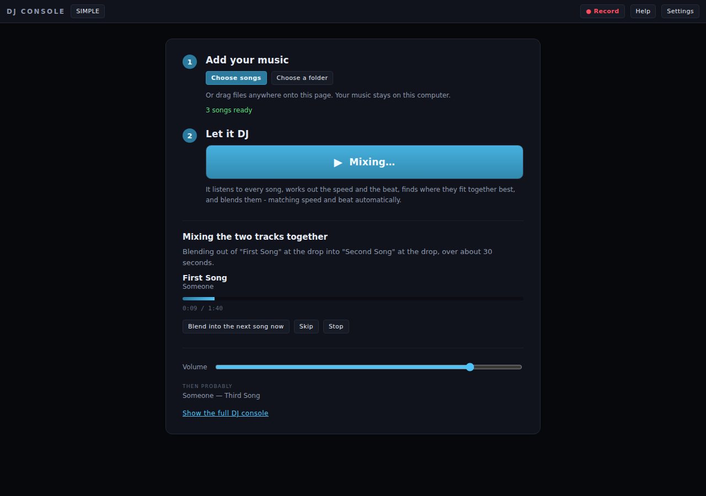
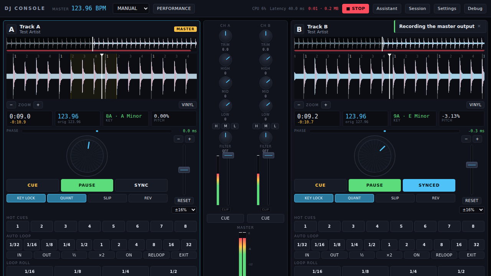

# DJ Console

A DJ app that runs on your own computer. Add some songs, press one button, and
it mixes them for you — matching their speed, lining up their beats, and
choosing where the two songs fit together best.

Your music never leaves the machine. No accounts, no uploads, no cloud.

```
npm install
npm run dev          # then open http://localhost:5173
```

---

## Just want it to DJ for you?

That is the default. You get one screen:



1. **Add your music.** Choose files, choose a folder, or drag them anywhere
   onto the page.
2. **Press the big button.** That is it.

It listens to every song first — working out its speed, where the beats are,
what key it is in, and which parts are loud, quiet, building or dropping. Then
it starts one playing, picks a good song to follow it, and blends them at the
moment they fit together best.

While it runs it tells you what it is doing in plain English:

> Playing "First Song". Blending into "Second Song" in 0:58 — leaving at the
> outro, starting the next track where its intro ends, over about 30 seconds.

Three buttons are there if you want them: **blend now** (don't wait), **skip**,
and **stop**. Everything else is optional.

### How it decides where to join two songs

Not "fade out at the end". It scores every sensible pairing of *leave the old
song here* and *start the new song there*, using what the analysis found:

- **Leave late, and leave calm.** It wants to play most of a song, and to mix
  out where things are winding down — an outro or a quiet passage — rather than
  in the middle of a drop.
- **Come in where the song starts.** Usually right where the incoming track's
  intro hands over, so you don't throw away the first minute of it.
- **Match the energy.** Two moments at a similar level blend invisibly. A
  slight lift is good — that's how a set builds. A big drop kills the room.
- **Land on a phrase.** Both points snap to 16-bar boundaries, so the join
  happens where the music expects a change.
- **Pick the technique to suit.** Speeds too far apart to blend cleanly → cut
  over quickly. A drop arriving just after the join → build into it. Two calm,
  compatible tracks → a long, slow blend. Otherwise swap the bass across so the
  two kick drums never fight.

Every choice comes back as a sentence you can read, not a number.

---

## Want the actual DJ console?

Press **Show the full DJ console**, or cycle the button in the top bar:
**SIMPLE → CONSOLE → ADVANCED**. The music keeps playing the whole time.



There is a **Help** button in the top bar that explains every control in plain
language — including the one everybody asks about:

> **SYNC** speeds the deck up or slows it down to match the other one, then
> nudges it so its beats land exactly on top of the other track's beats.
> Without it, the two drum patterns drift apart within seconds and it sounds
> like a stumble.
>
> It says **SYNCING** while it is still pulling them into line, and **SYNCED**
> only once they are actually locked. The number next to **PHASE** is the real
> error, in milliseconds.

---

## The one rule

**If the interface says something, the audio engine is doing it.**

- `SYNCED` lights only when the phase controller reports an error inside its
  lock threshold. While it is still converging it says `SYNCING`.
- The BPM shown is the grid tempo multiplied by the rate the worklet is
  *actually* running at, read back every frame.
- `LOOP 4` means the audio engine is looping over exactly four beats, to the
  sample.
- When tempo detection is not confident, the deck says so and asks, instead of
  showing a number that looks authoritative.

The playhead is owned by the audio thread and published to the UI through a
`SharedArrayBuffer` (falling back to the message port when the page is not
cross-origin isolated). Nothing in the interface computes a position of its
own, and no waveform is animated by CSS.

---

## What works

**Decks** — sample-accurate playback, cubic-interpolated variable-rate
resampling, WSOLA time-stretching for true key lock, independent key shift
(±12 semitones), sample-accurate looping, slip mode, scratching and reverse via
genuine negative playback rates, de-click ramps on play, pause and seek.

**Analysis** — spectral-flux onset detection, autocorrelation tempo estimation
with comb refinement, beat grid with downbeat detection, chromagram key
detection with Camelot notation, multi-band waveform peaks, an energy curve,
approximate BS.1770 integrated loudness, and heuristic section labelling with
confidence values. Runs in a Web Worker and is cached by content hash.

**Sync** — tempo matched by ratio, phase aligned once on engage, then held by a
PI controller that trims playback rate by fractions of a percent. Measured
steady-state error in the end-to-end browser test is **0.1–0.6 ms**.

**Mixer** — trim, three-band EQ with kill switches, bipolar filter, channel
faders, crossfader with three curves, PFL headphone cue, master limiter,
per-sample peak metering with hold and clip detection, automatic gain staging.

**Performance** — 8 hot cues, auto-loop from 1/32 to 32 beats, loop roll, beat
jump, quantise, 14 effects with beat-synced timing, 8 sampler pads with
quantised triggering.

**Library** — drag-and-drop import (files or whole folders), search, filters,
sorting, ratings, track compatibility analysis, and next-track suggestions with
the reasoning shown.

**Everything else** — master recording to WAV, session save and restore,
remappable keyboard shortcuts, Web MIDI with learn mode, an Auto DJ with seven
transition styles, a rule-based command assistant, and a debug panel exposing
live engine state.

---

## Architecture

```
                         UI  (canvas + direct DOM, one rAF loop)
                          |
                   DJ state engine        musical decisions
                          |
      +-------------------+-------------------+
      |                   |                   |
  Deck engine          Mixer              FX engine
      |                   |                   |
      +-------------------+-------------------+
                          |
                    Audio engine             Web Audio graph
                          |
              AudioWorklet (audio thread)     playback, WSOLA, loops
```

Analysis runs in a Web Worker. Playback runs in an AudioWorklet. The main
thread only draws and decides.

| Path | What lives there |
| --- | --- |
| `public/worklets/deck-processor.js` | The playback core. WSOLA, looping, slip, scratch, de-click. |
| `public/worklets/meter-processor.js` | Per-sample peak/RMS metering with clip detection. |
| `public/worklets/recorder-processor.js` | Master bus tap for recording. |
| `src/audio/` | Engine graph, deck wrapper, sync controller, FX, sampler, recorder. |
| `src/analysis/` | Onset, tempo, grid, key, loudness, structure, waveform. |
| `src/lib/` | Grid maths, music theory, DSP, storage, MIDI, keyboard, Auto DJ, assistant. |
| `src/state/` | Store, library/import pipeline, DJ state engine. |
| `src/ui/` | Deck view, waveforms, jog wheels, mixer, FX, library, panels. |

### No runtime dependencies

Nothing ships to the browser but this repository's own code. The FFT, the
time-stretcher, the resampler, the beat tracker, the key detector, the
reverb, the WAV encoder and the widget layer are all here and all readable.
Build tooling (Vite, TypeScript, Vitest, Playwright) is dev-only.

### Why no UI framework

At 60 fps with two scrolling waveforms, two rotating platters, six meters and a
pair of phase displays, reconciling a component tree every frame is the wrong
tool. Views subscribe to specific state channels and touch only the nodes that
changed; anything animating reads engine state directly in the single rAF loop
in `src/main.ts`.

---

## How sync actually works

Not this:

```js
setInterval(() => { deckB.position = deckA.position; }, 100);  // no
```

That fights the audio clock and you can hear every correction. Instead:

1. **Tempo** is matched exactly and instantly by setting the follower's
   playback rate to `masterBpm / followerBpm`, folded by octaves so a 70 BPM
   track syncs to a 140 BPM master at 1.0x rather than 2.0x.

2. **Phase** is aligned *once*, when sync engages, by a single seek to the
   correct beat — quantised to the bar so downbeats meet downbeats. That is the
   only time sync ever writes a position, and only when the error is large
   enough that a seek beats waiting.

3. **Lock** is then held by a PI controller that trims the follower's *rate* by
   fractions of a percent. Gains are derived from the loop dynamics rather than
   guessed: the plant is an integrator, so `KP = 0.5` gives a settle time of
   `60/(bpm·KP)` ≈ 0.94 s at 128 BPM, and the output saturates at 0.08 beats of
   error so a shove is recovered inside a couple of bars. Correcting with rate
   rather than position means the audio is never cut — it runs imperceptibly
   fast or slow until the error is gone, exactly as a DJ nudging a platter
   would.

The controller samples at frame rate, but that only bounds how quickly a
*disturbance* is noticed. It does not bound accuracy: the integrator drives
steady-state error to zero, and the measurement comes from playheads the audio
thread maintains sample by sample.

---

## Time-stretching

Key lock is a real WSOLA implementation in the worklet, not a playback-rate
change:

- Synthesis hop 512, periodic Hann window of 1024 at 50% overlap, which sums to
  exactly unity.
- Grain alignment by normalised cross-correlation over ±128 samples, computed
  on a 2× decimated signal to keep it cheap.
- The drift-free analysis pointer always advances by exactly the analysis hop.
  The correlation offset changes which samples are *read*, never how far the
  pointer moves — so stretching introduces no cumulative drift.

Pitch and speed are separated as `speed = stretch × pitch`, so key lock, tempo
and key shift compose correctly. Scratching and reverse bypass WSOLA entirely
and use direct negative-rate resampling, which is what makes them sound like a
record rather than a seek.

Measured in the test suite: **under 20 ms of accumulated position error across
80 seconds** of stretched playback, and pitch held to within a couple of Hz at
1.25× speed.

---

## Testing

```
npm run verify    # typecheck + unit tests + production build
npm test          # unit tests only
```

**208 unit tests.** The worklet tests are not a reimplementation — they load
`public/worklets/deck-processor.js`, the exact file the browser runs, into a
stubbed `AudioWorkletGlobalScope` and render real blocks through it. They cover
the no-drift invariant at five playback rates, pitch preservation under key
lock, sample-accurate loop wrapping, slip return, scratch, reverse, de-click
behaviour, and that no sample is ever non-finite.

The sync tests simulate two decks whose playheads advance at whatever rate the
controller sets, and assert that it converges, stays locked over five simulated
minutes, recovers from a shove, and never seeks to fix a small error.

**End-to-end browser tests.** Two of them, both driving the real built app in
Chromium:

```
npm run build
npm run preview          # terminal 1
npm run smoke            # terminal 2 - the full console
npm run smoke:simple     # terminal 2 - the one-button path
```

`smoke` generates two WAVs at 124 and 128 BPM, runs them through the real
import and analysis path, plays both decks, engages sync, and asserts on what
the engine reports:

```
crossOriginIsolated: true
ANALYSIS: 123.96 BPM (conf 1.00, A minor) · 127.96 BPM (conf 1.00, E minor)
SYNC: master A, locked, phase -0.36 ms, B pitched 127.96 -> 123.96
FEATURES: loop 1.9361084220716354 s (expected 1.936108422071636)
ALL CHECKS PASSED
```

`smoke:simple` does what a first-time user does — lands on the page, adds three
songs, presses the one button — and checks that the console started a track,
queued the next one, matched its tempo, chose a join point late in the outgoing
track, and explained itself in a sentence. It then forces the blend and
confirms both decks are playing and beat-locked:

```
LANDING: mode=simple, console hidden, button disabled until music is added
AFTER PRESS: playing [A], loaded [A,B], both at 125.99 BPM, auto mixing on
  "Blending into Second Song in 0:58 - leaving at the outro..."
PLAN: eq, exit 61.9s of 100s, entry 31.9s, 30s blend
BLEND: both decks playing, locked, phase 0.02 ms
ALL CHECKS PASSED
```

---

## Honest limits

Things worth knowing before you rely on them.

- **Decoding uses the browser's own codecs.** MP3, WAV, FLAC, M4A/AAC and OGG
  work in Chromium. Support varies by browser, and unsupported files produce a
  clear error rather than silence. There is no bundled FFmpeg.
- **The beat grid assumes constant tempo.** It is fitted once per track. Live
  recordings and anything with a real tempo change will drift; the grid editor
  exists for exactly that, and the analyser reports low confidence when it is
  unsure rather than pretending.
- **Section labels are heuristics.** "Drop", "breakdown" and the rest come from
  an energy-novelty segmentation, and every one carries a confidence the
  transition engine weighs. They are not reliable enough to trust blindly, and
  the code does not.
- **Grid phase carries about 5 ms of systematic bias** from the attack
  detector's analysis window — roughly 1% of a beat at 128 BPM. It is common to
  both decks, so it cancels in the phase controller, which aligns grids against
  each other rather than against absolute time.
- **One audio output.** The Web Audio API does not expose per-node device
  routing, so the PFL cue bus is folded into the main output under the CUE MIX
  knob rather than going to a separate headphone device.
- **Auto gain will not clip to hit its target.** A quiet track with peaks near
  full scale is left short of the target loudness rather than distorted; the
  deck shows the trim it applied.
- **Web MIDI is Chromium and Edge only** at present.
- **Everything lives in this browser's IndexedDB.** Clearing site data clears
  the library. There is no export yet beyond recorded mixes.
- **Auto DJ picks from what you have given it.** It scores tracks on tempo,
  key, energy and your ratings, and avoids anything played recently — but it
  has no idea what the room wants. If it keeps choosing something you dislike,
  rate it down or remove it.

## Cross-origin isolation

The dev and preview servers send `Cross-Origin-Opener-Policy: same-origin` and
`Cross-Origin-Embedder-Policy: require-corp`, which enable `SharedArrayBuffer`
and so the low-jitter playhead. If you host the build elsewhere, send those two
headers too. Without them the app still works — it falls back to the message
port automatically, and the debug panel tells you which transport is live.

## Browser support

Developed and tested against Chromium. Requires AudioWorklet, Web Workers,
IndexedDB and `OfflineAudioContext`-free analysis (all analysis is plain
TypeScript, so it runs anywhere a worker does). Firefox and Safari should run
the engine; Web MIDI and some codecs will not be available.
